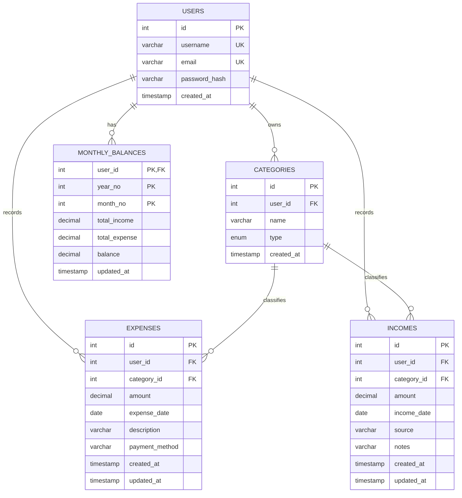

# ER Diagram

## Relationship Notes

- One user can have many categories.
- One user can have many expenses and many income records.
- One category can classify many expenses or income records.
- One user has one monthly balance row per year and month.
- `monthly_balances` is maintained automatically by triggers after insert, update, and delete operations on `expenses` and `incomes`.

